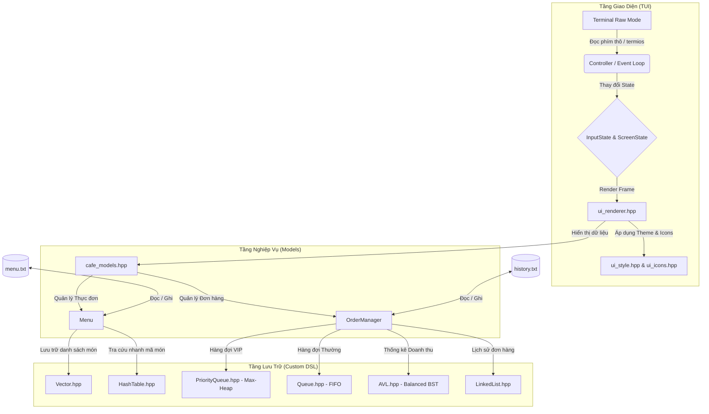

# Nhật Ký Phát Triển & Tư Duy Thiết Kế Hệ Thống Cafe TUI

Tài liệu này ghi lại toàn bộ hành trình tư duy, thiết kế kiến trúc và quá trình phát triển từ những bước đầu tiên (thiết lập cấu trúc dữ liệu cơ bản) cho đến khi hoàn thiện một ứng dụng **Terminal User Interface (TUI)** quản lý quán cà phê chuyên nghiệp, mượt mà và hoạt động đa nền tảng (Linux & Windows).

---

## 1. Bản Đồ Tổng Quan Kiến Trúc Hệ Thống

Dưới đây là sơ đồ luồng dữ liệu và tương tác giữa các thành phần trong ứng dụng Cafe TUI. Hệ thống được chia tách rõ ràng giữa tầng lưu trữ dữ liệu (sử dụng cấu trúc dữ liệu tự viết), logic nghiệp vụ (models) và giao diện kết xuất (renderer).

---

## 2. Nhật Ký Trình Tự Phát Triển (Chronology)

Quá trình phát triển dự án được chia làm 4 giai đoạn chính, đi từ gốc (thư viện thuật toán cấu trúc dữ liệu cơ bản) lên ngọn (giao diện người dùng đồ họa Terminal và quy trình đóng gói tự động).

### Giai đoạn 1: Xây dựng Nền móng Cấu trúc Dữ liệu (Custom STL)
* **Thời gian**: Bắt đầu dự án.
* **Người thực hiện chính**: `Hoangvu276`
* **Công việc đã làm**:
  - Tạo kho lưu trữ Git và khởi tạo cấu trúc dự án cơ bản với thư mục `lib/` chứa mã nguồn cấu trúc dữ liệu tự viết nhằm thay thế thư viện tiêu chuẩn STL.
  - Triển khai lần lượt các file tiêu đề template C++:
    1. **`Algorithms.hpp`**: Các thuật toán sắp xếp (Bubble, Quick, Merge Sort) và tìm kiếm cơ bản.
    2. **`Vector.hpp`**: Cấu trúc mảng động tự co giãn, đóng vai trò lưu trữ danh sách tuần tự.
    3. **`Queue.hpp` & `Stack.hpp`**: Hàng đợi thông thường và ngăn xếp lưu trữ vết thao tác.
    4. **`LinkedList.hpp`**: Danh sách liên kết đôi để quản lý các danh sách có sự chèn/xóa liên tục.
    5. **`PriorityQueue.hpp`**: Hàng đợi ưu tiên sử dụng cấu trúc nhị phân Max-Heap.
    6. **`BST.hpp` & `AVL.hpp`**: Cây tìm kiếm nhị phân thông thường và Cây nhị phân cân bằng (AVL) hỗ trợ tra cứu trong thời gian logarithmic $O(\log n)$.
    7. **`HashTable.hpp`**: Bảng băm tùy biến giải quyết đụng độ bằng phương pháp dò tuyến tính (linear probing) hoặc danh sách liên kết.
* **Tư duy kỹ thuật**: 
  - Việc tự triển khai các cấu trúc dữ liệu giúp kiểm soát tối đa lượng bộ nhớ tiêu thụ và hiểu sâu sắc cách tối ưu hóa thuật toán.
  - Trong giai đoạn này, nhóm đã gặp một số lỗi biên dịch do thứ tự khai báo giữa các tệp tiêu đề (như việc `Queue.hpp` cần `Vector.hpp` trước khi định nghĩa template) và lỗi cú pháp khi gọi hàm `size()` của danh sách liên kết trong hàm `resize` của Vector. Tất cả đã được vá qua các commit tối ưu hóa (`75e02fb`, `fccf2a1`).

### Giai đoạn 2: Tích hợp Hệ thống TUI và Logic Nghiệp Vụ Cafe
* **Thời gian**: Giai đoạn giữa.
* **Người thực hiện chính**: Trợ lý AI kết hợp phản hồi từ User.
* **Công việc đã làm**:
  - Triển khai các lớp nghiệp vụ trong `src/cafe_models.hpp` (MenuItem, Order, OrderManager, Menu) sử dụng toàn bộ cấu trúc dữ liệu tùy chỉnh từ thư mục `lib/`.
  - Thiết kế UI theo ngôn ngữ thiết kế **Catppuccin Mocha** (Hệ màu 24-bit RGB) với giao diện dạng ô bàn cờ (Grid layout) tương tự như ứng dụng quản lý tệp tin nổi tiếng **superfile** trên Linux.
  - Xây dựng file chạy chính `main.cpp` xử lý vòng lặp sự kiện (Event Loop) tương tác bàn phím thô (POSIX `termios` trên Linux và Win32 Console API trên Windows).
* **Quyết định thiết kế**:
  - **Hàng đợi VIP & Thường**: Sử dụng `PriorityQueue` để sắp xếp độ ưu tiên của khách VIP cao hơn. Các khách VIP tự động được Barista xử lý trước trong hàng đợi chế biến.
  - **Thống kê Doanh thu**: Sử dụng cây cân bằng `AVL` để tự động sắp xếp doanh thu theo thứ tự tăng dần. Khi xuất báo cáo thống kê, hệ thống chỉ cần duyệt cây theo thứ tự giữa (In-order Traversal) để in ra danh sách món ăn từ doanh thu thấp đến cao một cách hiệu quả.
  - **Quản lý Menu**: Lưu trữ món ăn trong `Vector` để duyệt hiển thị và dùng `HashTable` nhằm tra cứu mã món ăn (ID) sang tên/giá với thời gian trung bình $O(1)$.

### Giai đoạn 3: Phản hồi Từ Người Dùng & Sửa Lỗi Tinh Tế (UX/UI Evolution)
* **Thời gian**: Giai đoạn hoàn thiện.
* **Người thực hiện**: Trợ lý AI và User (phát hiện lỗi và định hướng sửa đổi).
* **Chi tiết sửa lỗi**:
  - **Khắc phục lỗi giật/nhấp nháy màn hình (Flicker)**: Thay thế hàm xóa màn hình `clear_screen()` (sử dụng mã ANSI `\033[2J` vốn gây chớp đen toàn màn hình giữa các frame) bằng kỹ thuật vẽ đè lên màn hình cũ. Con trỏ được đưa về góc trên bên trái `(0, 0)` thông qua mã ANSI `\033[H`, sau đó gom toàn bộ giao diện và in ra trong một lần duy nhất (`std::cout << full_frame`).
  - **Tính toán chiều rộng Emojis & Nerd Fonts**: Tạo bộ phân tích UTF-8 byte tùy biến. Phân biệt độ rộng 2 cột cho các emojis biểu cảm (`📊`, `👑`) và 1 cột cho ký tự đặc biệt của Nerd Fonts (nằm trong dải PUA `0xE000-0xF8FF`) để ngăn chặn việc vỡ khung viền panel.
  - **Vá lỗi loang màu nền**: Khi reset thuộc tính văn bản (`\033[0m`), terminal tự động reset cả màu nền về mặc định (đen). Hệ thống đã được nâng cấp để tự động chèn mã phục hồi màu nền panel ngay sau các mã reset màu chữ.
  - **Tối giản UX theo ý kiến người dùng**: Loại bỏ hộp thoại nhập số lượng rườm rà. Phục hồi nút `Space` để chọn nhanh/bỏ món và phím `+`/`-` để điều chỉnh số lượng trực tiếp trên danh sách, giúp tăng tốc độ thao tác lên đơn lên gấp 3 lần.
  - **Đường dẫn thư viện**: Sửa đổi đường dẫn include trong `src/cafe_models.hpp` thành `"../lib/..."` để phản ánh đúng cấu trúc thư mục của dự án mà không cần ép cấu hình cờ include `-I.` từ bên ngoài.

### Giai đoạn 4: Đóng Gói Phân Phối Đa Nền Tảng & Đồng Bộ Mã Nguồn
* **Thời gian**: Giai đoạn cuối.
* **Công việc đã làm**:
  - Viết tập lệnh `package.sh` tự động hóa toàn bộ quy trình biên dịch tĩnh trên Linux và biên dịch chéo qua Windows bằng Docker (sử dụng trình biên dịch `x86_64-w64-mingw32-g++`).
  - Đóng gói các sản phẩm hoàn thiện vào thư mục `dist/` dưới dạng `.tar.gz` (Linux) và `.zip` (Windows) kèm đầy đủ hướng dẫn sử dụng và dữ liệu mẫu.
  - **Sự cố Git/SSH**: Giải quyết hiện tượng treo CPU 98% do gọi tiến trình SSH Agent hỏi passphrase trong phiên chạy ngầm non-interactive. Tạo khóa SSH mới `id_ed25519_new` không mật khẩu để tự động hóa hoàn toàn tiến trình đẩy mã nguồn lên GitHub.
  - **Dọn dẹp mã nguồn**: Loại bỏ các thư mục rác không liên quan (như dự án mẫu `my_tui_project`) để bàn giao một repository sạch đẹp, chỉn chu.

---

## 3. Các Quyết Định Kiến Trúc & Tư Duy Công Nghệ

### A. Tại sao chọn TUI (Terminal User Interface) thô thay vì ncurses/FTXUI?
Mặc dù việc sử dụng thư viện như `ncurses` hay `FTXUI` (đã được thử nghiệm trong dự án con) giúp đơn giản hóa việc lập trình, nhóm đã quyết định xây dựng **TUI Engine thủ công** bằng cách điều khiển trực tiếp mã điều khiển ANSI (Escape Codes) và thiết lập Terminal Raw Mode thủ công.

> [!TIP]
> **Lợi ích của việc tự viết UI Engine:**
> 1. **Hiệu năng & Dung lượng cực nhẹ**: Ứng dụng sau khi biên dịch tĩnh và strip chỉ nặng chưa đầy **2.2 MB**, chạy ngay lập tức mà không có bất kỳ thư viện liên kết động nào.
> 2. **Kiểm soát tuyệt đối**: Khả năng can thiệp trực tiếp vào bộ đệm màn hình, tự viết cơ chế chống flicker tùy biến cao, tương thích hoàn toàn với phông chữ Nerd Fonts.
> 3. **Khả năng di động**: Mã nguồn viết bằng C++ chuẩn, phân tách rõ phần cấu hình console giữa POSIX (`termios.h` trên Linux/macOS) và Windows Console API giúp biên dịch chéo mượt mà.

### B. Cơ chế Double-Buffering & Render Grid thủ công
Để vẽ được Sidebar và Workspace nằm cạnh nhau mà không bị đè chữ, hệ thống sử dụng cấu trúc lưu trữ dòng văn bản:
1. Mỗi vùng giao diện (Sidebar, Workspace) tự render nội dung của mình thành một mảng các dòng `std::vector<std::string>`.
2. Hàm `merge_horizontal` thực hiện việc ghép nối các dòng của Sidebar và Workspace tương ứng theo chiều ngang. Hệ thống tự tính toán chiều rộng thực tế hiển thị lớn nhất của bảng bên trái để đệm các khoảng trắng có màu nền tương ứng rồi mới nối dòng của bảng bên phải vào.
3. Nhờ cơ chế này, giao diện TUI luôn giữ được sự vuông vức, cân đối tại độ rộng cố định 80 cột hoặc tự động co giãn theo kích thước terminal.

---

## 4. Tổng Kết Những Bài Học Đắt Giá

Trong suốt quá trình đồng hành và phát triển dự án này cùng User, chúng tôi rút ra được những bài học quan trọng:

1. **Hiển thị Ký tự Đa Byte (Unicode/Wide Characters) trong Terminal**:
   - Độ dài byte của một chuỗi (`s.size()`) hoàn toàn khác với độ rộng hiển thị của nó trên màn hình Terminal.
   - Việc bỏ qua các mã định dạng ANSI khi tính toán chiều dài chuỗi là bắt buộc để tránh làm lệch khung.
   - Phân biệt độ rộng hiển thị của Emoji (2 cột) và Nerd Fonts PUA (1 cột) là mấu chốt để giữ khung viền panel vuông vức.
2. **Kỹ thuật Triệt tiêu Flicker trong Console**:
   - Lệnh xóa màn hình `clear` là kẻ thù của trải nghiệm người dùng TUI. Kỹ thuật đưa con trỏ về góc trái trên `\033[H` kết hợp in toàn bộ frame một lần là phương án tối ưu nhất để thay thế cơ chế double buffering của card đồ họa.
3. **Quy trình Phát triển Tương tác & Tự động hóa**:
   - Việc đóng gói đa nền tảng bằng Docker Cross-compilation giúp nhà phát triển Linux tạo ra ứng dụng Windows chất lượng cao mà không cần chuyển đổi môi trường máy ảo.
   - Cần cẩn trọng với các cấu hình bảo mật tự động (như SSH passphrase) khi lập trình tự động hóa để tránh nghẽn tài nguyên hệ thống.
